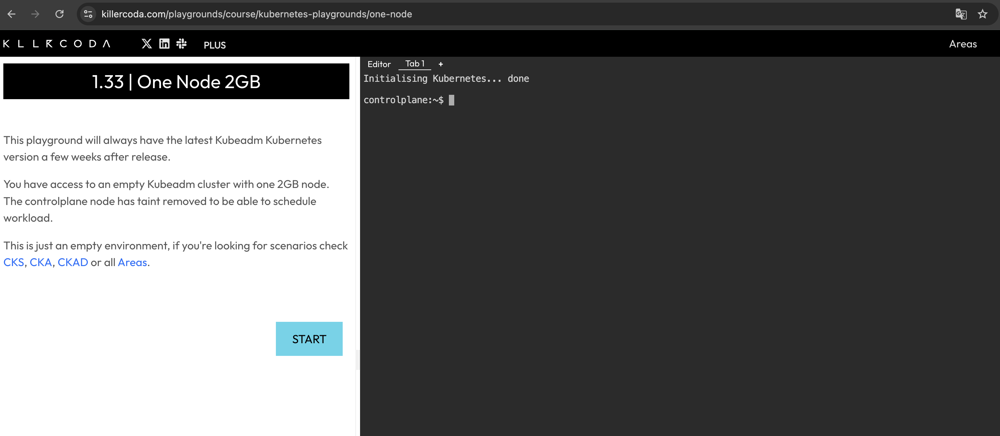

# Kubernetes CTF Samples

Kubernetes CTF（Capture The Flag）のサンプル問題集です。

## 環境準備

Killercoda などの Playground サービスを使用することを推奨します。

- [Killercoda](https://killercoda.com/)
- [iximiuz Labs](https://labs.iximiuz.com/playgrounds?category=kubernetes&filter=all)
- [KodeKloud](https://kodekloud.com/public-playgrounds)

   

また、ローカル環境でも以下のようなツールを使用して実行できます。

- [kind](https://github.com/kubernetes-sigs/kind)
- [minikube](https://github.com/kubernetes/minikube)

## 前提条件

- `kubectl` コマンドがインストールされている
- Kubernetes クラスタへの管理者権限
- 基本的な Kubernetes の知識（Pod、Service、Deployment 等）

## ルールと注意事項

⚠️ 本 CTF は学習・教育目的で作成されています。本番環境や共有環境では実行しないでください

- 本 CTF は、Kubernetes の基本的な知識と、`kubectl` の操作だけで解答できる問題です
- フラグは `CTF{...}` の形式で記載されています
- 与えられた権限の範囲で、フラグの文字列を取得してください
- コードを見ながら解くこともできますが、問題の難易度は下がります

## チャレンジ一覧

| Title | Level |
|:-----:|:---------:|
| Challenge 00 (チュートリアル) | 🔰 |
| Challenge 01 | ⭐️ |
| Challenge 02 | ⭐️ |
| Challenge 03 | ⭐️⭐️ |
| Challenge 04 | ⭐️ |
| Challenge 05 | ⭐️ |

Kubernetes クラスタにアクセスできる状態で、各チャレンジのセットアップスクリプトを実行してください。

### Challenge 00 (チュートリアル)

CTF 形式と基本的なkubectlコマンドを学ぶためのチュートリアル問題です。

```bash
chmod +x challenge00_setup.sh
./challenge00_setup.sh

# CTF 用の kubeconfig を設定
export KUBECONFIG=./ctf-0.kubeconfig
```

**目標**: Kubernetes クラスタのどこかに隠されているフラグを見つけてください。

<details><summary>解答手順</summary>

1. 最初に kubeconfig を変更し、CTF 用の権限でアクセスできていることを確認します。

   ```bash
   $ kubectl auth whoami
   ATTRIBUTE   VALUE
   Username    system:serviceaccount:ctf-0:ctf-player-0
   UID         16f388b9-5cbd-4059-a38a-a86e2efb9817
   Groups      [system:serviceaccounts system:serviceaccounts:ctf-0 system:authenticated]
   ```

   ユーザー名が `ctf-player-0` と表示されていれば成功です。

2. 続いて、クラスタの中で何の操作できるかを確認します。

   ```bash
   $ kubectl auth can-i --list
   ```

   出力結果の中に以下の行があり、SecretリソースのList権限を持っていることがわかります。
   ```
   secrets                               []                           []            [list]
   ```

3. Namespace内のすべてのSecretを一覧表示します。
   ```bash
   $ kubectl get secret
   NAME                 TYPE                                  DATA   AGE
   ctf-player-0-token   kubernetes.io/service-account-token   3      23m
   flag-secret          Opaque                                1      23m
   ```
   `flag-secret`という名前の Secret がありました。この Secret の中にフラグの文字列がありそうです。

4. `flag-secret` のマニフェスト情報を取得してみます。
   ```bash
   $ kubectl get secret flag-secret -o yaml
   Error from server (Forbidden): secrets "flag-secret" is forbidden: User "system:serviceaccount:ctf-0:ctf-player-0" cannot get resource "secrets" in API group "" in the namespace "ctf-0"
   ```
   しかし、Secret の `get` 権限がないため失敗します。

5. 今度は、Secret を指定せずにマニフェスト情報を一覧取得してみます。

   ```bash
   $ kubectl get secrets -o yaml
   ```
   これは特定の Secret を取得しているのではなく、すべてのSecretを一覧表示しているため動作します！

6. 最後に、出力の中からフラグを探してください。フラグはbase64エンコードされているので、デコードします。
   ```bash
   $ echo "Q1RGe1dlbGNvbWVfVG9fS3ViZXJuZXRlc19DVEZfVHV0b3JpYWx9" | base64 -d
   CTF{Welcome_To_Kubernetes_CTF_Tutorial}
   ```

</details>

<br/>

チャレンジが終わったら、以下のコマンドで環境をクリーンアップします。

<details><summary>クリーンアップ</summary>

```bash
unset KUBECONFIG && kubectl delete ns ctf-0 --ignore-not-found=true
```

</details>

### Challenge 01

```bash
# CTF 用の kubeconfig 設定が残っていれば削除
unset KUBECONFIG

chmod +x challenge01_setup.sh
./challenge01_setup.sh

# CTF 用の kubeconfig を設定
export KUBECONFIG=./ctf-1.kubeconfig
```

<details><summary>クリーンアップ</summary>

```bash
unset KUBECONFIG && kubectl delete ns ctf-1 --ignore-not-found=true
```

</details>

### Challenge 02

```bash
# CTF 用の kubeconfig 設定が残っていれば削除
unset KUBECONFIG

chmod +x challenge02_setup.sh
./challenge02_setup.sh

# CTF 用の kubeconfig を設定
export KUBECONFIG=./ctf-2.kubeconfig
```

<details><summary>クリーンアップ</summary>

```bash
unset KUBECONFIG && kubectl delete ns ctf-2 --ignore-not-found=true
```

</details>

### Challenge 03

```bash
# CTF 用の kubeconfig 設定が残っていれば削除
unset KUBECONFIG

chmod +x challenge03_setup.sh
./challenge03_setup.sh

# CTF 用の kubeconfig を設定
export KUBECONFIG=./ctf-3.kubeconfig
```

<details><summary>クリーンアップ</summary>

```bash
unset KUBECONFIG && kubectl delete ns ctf-3 --ignore-not-found=true
```

</details>

### Challenge 04

```bash
# CTF 用の kubeconfig 設定が残っていれば削除
unset KUBECONFIG

chmod +x challenge04_setup.sh
./challenge04_setup.sh

# CTF 用の kubeconfig を設定
export KUBECONFIG=./ctf-4.kubeconfig
```

<details><summary>クリーンアップ</summary>

```bash
unset KUBECONFIG && kubectl delete ns ctf-4 --ignore-not-found=true
```

</details>

### Challenge 05

```bash
# CTF 用の kubeconfig 設定が残っていれば削除
unset KUBECONFIG

chmod +x challenge05_setup.sh
./challenge05_setup.sh

# CTF 用の kubeconfig を設定
export KUBECONFIG=./ctf-5.kubeconfig
```

<details><summary>クリーンアップ</summary>

```bash
unset KUBECONFIG && kubectl delete ns ctf-5 --ignore-not-found=true
```

</details>

## Tips & Tricks

便利なコマンド一覧

```bash
# 自身の持っている権限を確認
kubectl auth can-i --list

# 特定リソースを一覧取得
# kubectl get [resourceType]
kubectl get po
kubectl get deploy
kubectl get events

# リソースのマニフェスト情報を取得
# kubectl get [resourceType] [resourceName] -o yaml
kubectl get po pod01 -o yaml

# 主要なリソースを一覧取得
kubectl get all

# リソースの詳細やイベント情報を取得
# kubectl describe [resourceType] [resourceName]
kubectl describe po pod01

# Pod に入って操作
# kubectl exec -it [podName] -- sh
kubectl exec -it pod01 -- sh

# ログの確認
# kubectl logs [podName]
kubectl logs pod01
```

---

## License

Apache License Version 2.0
