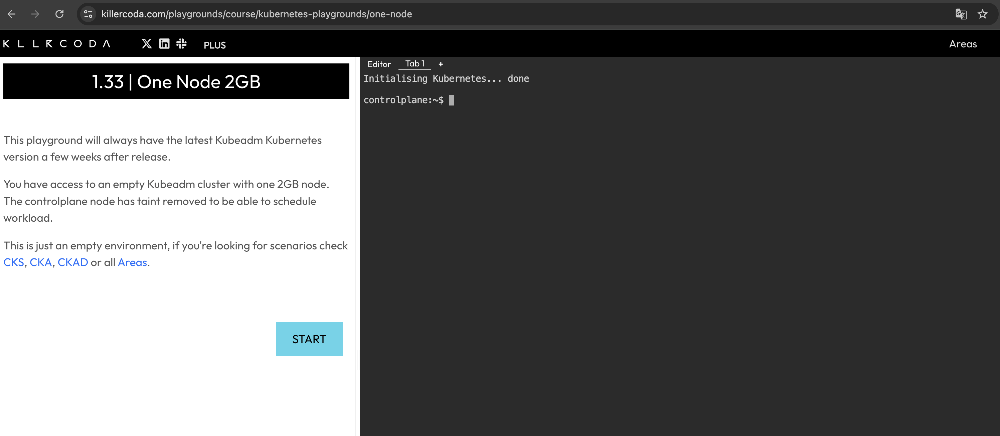

# Kubernetes CTF Samples

Sample challenges for Kubernetes CTF (Capture The Flag).

## Environment

The following playground services are recommended:

- [Killercoda](https://killercoda.com/)
- [iximiuz Labs](https://labs.iximiuz.com/playgrounds?category=kubernetes&filter=all)
- [KodeKloud](https://kodekloud.com/public-playgrounds)

   

You can also run these challenges in local environments using the following tools:

- [kind](https://github.com/kubernetes-sigs/kind)
- [minikube](https://github.com/kubernetes/minikube)

## Requirements

- `kubectl` command is installed
- Administrator access to a Kubernetes cluster
- Basic knowledge of Kubernetes (Pod, Service, Deployment, etc.)

## Rules

- This CTF can be solved with basic Kubernetes knowledge and `kubectl` operations only
- Flags are in the format `CTF{...}`
- Obtain the flag string within the given permission scope
- You can solve by examining the source code, but this will reduce the challenge difficulty

## Challenges

| Title | Level |
|:-----:|:---------:|
| Challenge 00 (Tutorial) | 🔰 |
| Challenge 01 | ⭐️ |
| Challenge 02 | ⭐️ |
| Challenge 03 | ⭐️⭐️ |

Please run the setup script for each challenge while having access to a Kubernetes cluster.

### Challenge 00 (Tutorial)

This is a tutorial challenge to learn CTF format and basic kubectl commands.

```bash
chmod +x challenge00_setup.sh
./challenge00_setup.sh

# Set CTF kubeconfig
export KUBECONFIG=./ctf-0.kubeconfig
```

**Objective**: Find the flag hidden somewhere in the Kubernetes cluster.

<details><summary>Solution Steps</summary>

1. First, change the kubeconfig and verify that you can access with CTF permissions:

   ```bash
   $ kubectl auth whoami
   ATTRIBUTE   VALUE
   Username    system:serviceaccount:ctf-0:ctf-player-0
   UID         16f388b9-5cbd-4059-a38a-a86e2efb9817
   Groups      [system:serviceaccounts system:serviceaccounts:ctf-0 system:authenticated]
   ```

   If the username shows `ctf-player-0`, it's successful.

2. Next, check what operations you can perform in the cluster:

   ```bash
   $ kubectl auth can-i --list
   ```

   In the output, you'll see the following line, indicating you have List permission for Secret resources:
   ```
   secrets                               []                           []            [list]
   ```

3. List all Secrets in the namespace:
   ```bash
   $ kubectl get secret
   NAME                 TYPE                                  DATA   AGE
   ctf-player-0-token   kubernetes.io/service-account-token   3      23m
   flag-secret          Opaque                                1      23m
   ```
   There's a Secret named `flag-secret`. The flag string is likely inside this Secret.

4. Try to get the manifest information of `flag-secret`:
   ```bash
   $ kubectl get secret flag-secret -o yaml
   Error from server (Forbidden): secrets "flag-secret" is forbidden: User "system:serviceaccount:ctf-0:ctf-player-0" cannot get resource "secrets" in API group "" in the namespace "ctf-0"
   ```
   However, this fails because you don't have `get` permission for Secrets.

5. Now try to get the manifest information of all Secrets without specifying a particular one:

   ```bash
   $ kubectl get secrets -o yaml
   ```
   This works because you're listing all Secrets, not getting a specific Secret!

6. Finally, look for the flag in the output. The flag is base64 encoded, so decode it:
   ```bash
   $ echo "Q1RGe1dlbGNvbWVfVG9fS3ViZXJuZXRlc19DVEZfVHV0b3JpYWx9" | base64 -d
   CTF{Welcome_To_Kubernetes_CTF_Tutorial}
   ```

</details>

<br/>

After completing the challenge, clean up the environment with the following command:

<details><summary>Cleanup</summary>

```bash
unset KUBECONFIG && kubectl delete ns ctf-0 --ignore-not-found=true
```

</details>

### Challenge 01

```bash
# Remove CTF kubeconfig setting if it remains
unset KUBECONFIG

chmod +x challenge01_setup.sh
./challenge01_setup.sh

# Set CTF kubeconfig
export KUBECONFIG=./ctf-1.kubeconfig
```

<details><summary>Cleanup</summary>

```bash
unset KUBECONFIG && kubectl delete ns ctf-1 --ignore-not-found=true
```

</details>

### Challenge 02

```bash
# Remove CTF kubeconfig setting if it remains
unset KUBECONFIG

chmod +x challenge02_setup.sh
./challenge02_setup.sh

# Set CTF kubeconfig
export KUBECONFIG=./ctf-2.kubeconfig
```

<details><summary>Cleanup</summary>

```bash
unset KUBECONFIG && kubectl delete ns ctf-2 --ignore-not-found=true
```

</details>

### Challenge 03

```bash
# Remove CTF kubeconfig setting if it remains
unset KUBECONFIG

chmod +x challenge03_setup.sh
./challenge03_setup.sh

# Set CTF kubeconfig
export KUBECONFIG=./ctf-3.kubeconfig
```

<details><summary>Cleanup</summary>

```bash
unset KUBECONFIG && kubectl delete ns ctf-3 --ignore-not-found=true
```

</details>

## Tips & Tricks

Useful Commands:

```bash
# Check your permissions
kubectl auth can-i --list

# List specific resources
# kubectl get [resourceType]
kubectl get po
kubectl get deploy
kubectl get events

# Get resource manifest
# kubectl get [resourceType] [resourceName] -o yaml
kubectl get po pod01 -o yaml

# List all major resources
kubectl get all

# Get detailed resource information and events
# kubectl describe [resourceType] [resourceName]
kubectl describe po pod01

# Execute commands in a Pod
# kubectl exec -it [podName] -- sh
kubectl exec -it pod01 -- sh

# Check logs
# kubectl logs [podName]
kubectl logs pod01
```

---

## License

Apache License Version 2.0
